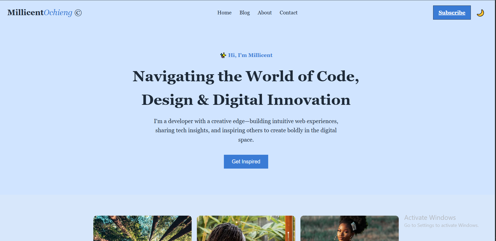
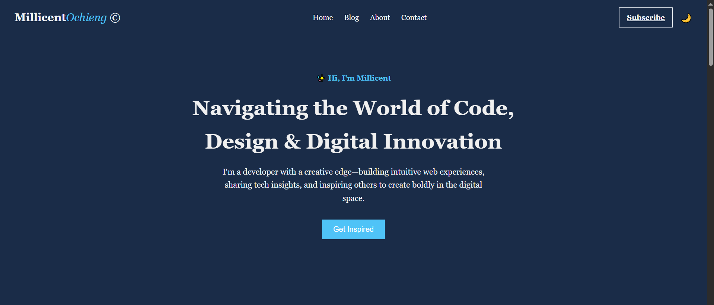
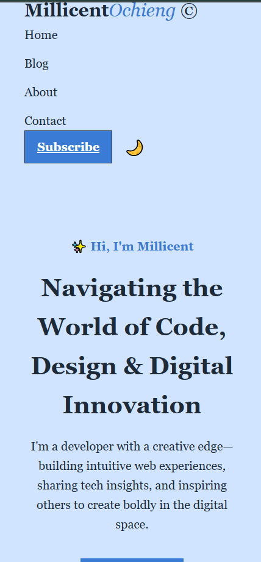

# Final Project and Deployment

## Objectives
Build a fully functional web application.
Apply HTML, CSS, and JavaScript concepts learned.
Deploy the project using GitHub Pages, Netlify, or Vercel.

## Instructions
Choose one of the following project ideas:
Blog Website: Implement a multi-page site with navigation.
Ecommerce Website: Implement a multi-page site with navigation.

>[!NOTE]
> - Include at least:
> - A responsive design.
> - JavaScript interactivity.
> - A deployment link.

## Tasks

Create a well-structured HTML5 document.
Use at least 5 different HTML elements.
Ensure semantic correctness.

Good luck and happy coding! 🚀💻

### THE ASSIGNMENT README

 ## Tech Blog Website
A responsive and modern tech blog website built with HTML, CSS, and JavaScript. It features sections like Hero, About, Blog Posts, and a Scroll-to-Top button with light/dark theme toggle.

## 🚀 Features
- 🌗 Dark/Light Mode Toggle using CSS variables

- 📰 Blog Cards with responsive layout

- 💬 My Story, Mission, and Flavors sections

- ⬆️ Scroll-to-Top Button with smooth scrolling

- 🎨 Fully responsive and mobile-friendly design

- ✨ Subtle animations and transitions

## 🛠️ Technologies Used
- HTML5

- CSS3 (Flexbox, Grid, Variables, Media Queries)

- JavaScript (for theme toggle and scroll behavior)

- Google Fonts

## 📁 Folder Structure
- tech-blog/
├── index.html
├── jabout.html
├── jblog.html
├── pagegallery2.html
├── style.css
├── script.js
└── img/
   
## 📸 Screenshots
- Homepage-
- Darkmode-
- Mobile view-

## 🚀 Live Demo

[Click here to view the live site](https://plp-webtechnologies.github.io/feb-2025-final-project-and-deployment-Ocheing/)

 
## 🧑‍💻 Setup Instructions
- Clone the repository:

git clone https://github.com/PLP-WebTechnologies/feb-2025-final-project-and-deployment-Ocheing.git
Open index.html in your browser.

✅ No dependencies or build tools needed—just open and go!

## ✍️ Author
Created by Millicent Anyango 
